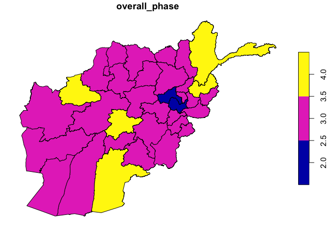

<!-- README.md is generated from README.Rmd. Please edit that file -->

# ripc

<!-- badges: start -->

[](https://github.com/OCHA-DAP/ripc/actions/workflows/R-CMD-check.yaml)
[](https://lifecycle.r-lib.org/articles/stages.html#experimental)
<!-- badges: end -->

The goal of ripc is to provide access to [Integrated Food Security Phase
Classification](https://www.ipcinfo.org) (IPC) and [Cadre
Harmonisé](https://www.ipcinfo.org/ch/) (CH) data.

## Installation

You can install the ripc from CRAN:

``` r
install.packages("ripc")
```

The development version can be installed from GitHub:

``` r
# install.packages("remotes")
remotes::install_github("OCHA-DAP/ripc")
```

## Usage

ripc provides functionality to access IPC data stored directly on the
[IPC-CH Public API](https://docs.api.ipcinfo.org). There are a wider set
of functions detailed further below, but most users will get the
information they need from the `ipc_get_population()` function which
returns datasets of country-level, group-level, and area-level analyses
in a list.

``` r
library(ripc)

df_list <- ipc_get_population()
df_list$country
#> # A tibble: 761 × 29
#>    analysis_id title       country condition analysis_date view_level ipc_period
#>          <dbl> <chr>       <chr>   <chr>     <chr>         <chr>      <chr>     
#>  1    65508276 Acute Food… HT      A         Mar 2024      area       A         
#>  2    65115079 Acute Food… PS      A         Feb 2024      area       C         
#>  3    65115079 Acute Food… PS      A         Feb 2024      area       C         
#>  4    65113995 Acute Food… KE      A         Feb 2024      area       A         
#>  5    65113995 Acute Food… KE      A         Feb 2024      area       A         
#>  6    65024769 Acute Food… SO      A         Jan 2024      area       A         
#>  7    65024769 Acute Food… SO      A         Jan 2024      area       A         
#>  8    64948217 Acute Food… MG      A         Dec 2023      area       A         
#>  9    64948217 Acute Food… MG      A         Dec 2023      area       A         
#> 10    64948217 Acute Food… MG      A         Dec 2023      area       A         
#> # ℹ 751 more rows
#> # ℹ 22 more variables: population <dbl>, population_percentage <chr>,
#> #   period <chr>, from <chr>, to <chr>, analysis_period_start <date>,
#> #   analysis_period_end <date>, p3plus <dbl>, p3plus_percentage <dbl>,
#> #   estimated_population <dbl>, phase1_population <dbl>,
#> #   phase1_percentage <dbl>, phase2_population <dbl>, phase2_percentage <dbl>,
#> #   phase3_population <dbl>, phase3_percentage <dbl>, …
```

While the default is to return data frames to the user, you can directly
access GeoJSON files from the IPC API.

``` r
df_areas <- ipc_get_areas(id = 12856213, period = "P", return_format = "geojson")
plot(df_areas[,"overall_phase"])
```



More details on the API are available below.

## IPC API

The ripc functions provide access to API endpoints detailed in the
[IPC-CH Public API](https://docs.api.ipcinfo.org) documentation. The
documentation should be referred to in order to better understand the
API calls themselves (under the simplified and advanced documentation
sections), and the returned data. For ease of the user, a table to match
up the simplified and advanced API endpoints with ripc functions is
below.

## API and ripc functions

In general, the same functions can access both API endpoints, but the
simplified endpoints are accessed with optional parameters while the
advanced endpoints are accessed when IDs and/or periods are explicitly
passed.

### Simplified API

| ripc                 | IPC API  |
|:---------------------|:---------|
| `ipc_get_analyses()` | analyses |
| `ipc_get_country()`  | country  |
| `ipc_get_areas()`    | areas    |
| `ipc_get_points()`   | points   |
| `ipc_get_icons()`    | icons    |

### Advanced API

| ripc                                   | IPC API              |
|:---------------------------------------|:---------------------|
| `ipc_get_analyses(id = ###)`           | analysis/{id}        |
| `ipc_get_areas(id = ###, period = X)`  | areas/{id}/{period}  |
| `ipc_get_population()`                 | population           |
| `ipc_get_population(id = ###)`         | population/{id}      |
| `ipc_get_points(id = ###, period = X)` | points/{id}/{period} |
| `ipc_get_icons(id = ###, period = X)`  | icons/{id}/{period}  |

## API access

Please refer to the [IPC API
documentation](https://docs.api.ipcinfo.org) to learn how to generate a
token for the API you can use to access the data. This API key should be
stored in your environment as `IPC_API_KEY`. You can easily add this to
your environment by adding the following line to your `.Renviron` file,
easily accessed using `usethis::edit_r_environ()`.

    IPC_API_KEY="API key here"

Make sure that your API key is granted access to the resources you need.

## Output data

Data coming from the IPC API isn’t immediately joinable, with varying
naming conventions for geographical name/ID columns. Outputs from the
ripc functions are wrangled to ease the joining of datasets together by
standardizing some column names and keeping the data in a tidy format.
You can specify `tidy_df = FALSE` for any `ipc_get_...()` function to
return directly what the IPC-CH Public API returns.

### Tidy data

The tidy format means that a specific analysis for a period (current,
projection, or second projection) and geography (area/point, group, or
country) are stored in a single row, with columns containing the
relevant metadata, phase classification, and population figures. Data
from mixed levels of geography are not stored in the same dataset.

While full documentation of output data can be derived from the [IPC API
schema documentation](https://docs.api.ipcinfo.org), key changes made to
the outputs to create tidy data are documented below.

- `analysis_id` is used across all datasets to identify the ID for a
  specific analysis.
- `area_id` and `area_name` is used to identify area and point IDs
  across the datasets.
- `group_id` and `group_name` for groups in the same manner.
- `title` refers solely to the title of the analysis.
- `phase#_num` and `phase#_pct` refer to the number of population and
  percent of population in each phase, respectively.
- `analysis_period_start` and `analysis_period_end` are created to be
  easy to access and manipulate date columns (rather than strings) in
  the dataset, representing the start of an analysis period (1st day of
  the first month) and end of an analysis period (last day of the last
  month).

Each exported function from ripc has a Tidy section describing the
wrangling done.

## Help and issues

For any help, please file an issue on
[Github](https://github.com/OCHA-DAP/ripc/issues).
